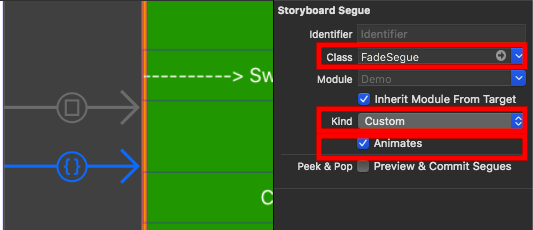

使用邊緣手勢 dismiss UIViewController.

Dismiss UIViewController with UIScreenEdgePanGestureRecognizer

[Demo]


## 需求
- Swift 5
- iOS 8+


## 安裝
使用 [Carthage]


## 使用
使用方法可分為:

1. [純代碼](#純代碼)
2. [攔截 Segue](#攔截-Segue)
3. [客製化](#客製化)


### 純代碼
參考 [FromViewController.swift-1].

```swift
let toVC: UIViewController = ...
toVC.dismissAnimator = DismissAnimator(root: toVC)
self.present(toVC, animated: true)
```


### 攔截 Segue
參考 [FromViewController.swift-2].

```swift
override func prepare(for segue: UIStoryboardSegue, sender: Any?)
{
    if segue.identifier == "presentDestinationViewController"
    {
        let destination = segue.destination
        destination.dismissAnimator = DismissAnimator(root: destination)
    }
}
```


### 客製化
照著 [客製化 Animator](#客製化-Animator), [客製化 Segue](#客製化-Segue) 完成後, 使用 [純代碼](#純代碼) 或是 [攔截 Segue](#攔截-Segue) 方式使用.

也可使用 Storyboard 客製化 Segue.




## 客製化 Segue
參考 [FadeSegue.swift]

1. Subclass UIStoryboardSegue.
2. Override perform function.
3. destination set dismissAnimator
4. source present destination

## 客製化 Animator
參考 [FadeAnimator.swift], [PushAnimator.swift]

1. Subclass DismissAnimator.
2. Overrid handlePresentAnimation function, **don't call super**.
3. Override handleDismissAnimation function, **don't call super**


[Demo]: https://appetize.io/app/zrfgc84ubjhp6ug024hdetpgx0?device=iphone6s&scale=75&orientation=portrait&osVersion=11.4
[Carthage]: https://github.com/Carthage/Carthage
[FromViewController.swift-1]: Demo/ViewController/FromViewController.swift#L26-L29
[FromViewController.swift-2]: Demo/ViewController/FromViewController.swift#L14-L18
[FadeSegue.swift]: Demo/CustomSegue/FadeSegue.swift
[FadeAnimator.swift]: Demo/CustomAnimator/FadeAnimator.swift
[PushAnimator.swift]: Demo/CustomAnimator/PushAnimator.swift
